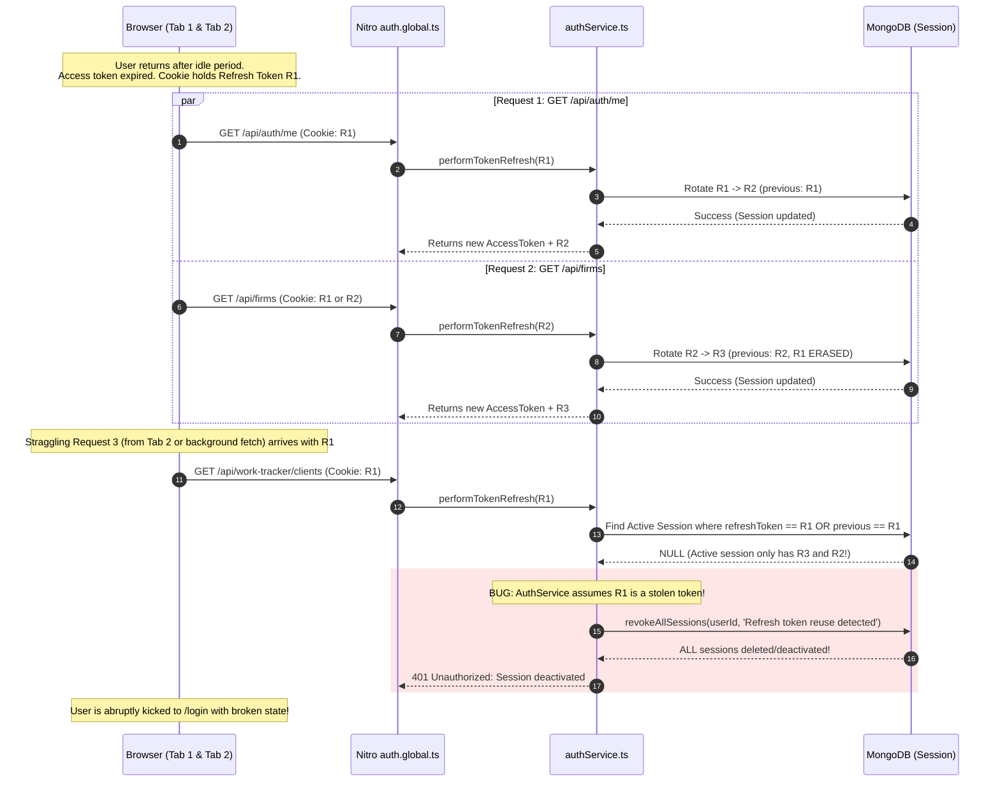

# Deep-Level Authentication & Concurrency Audit Report

**Application**: BusinessPro Suite (Nuxt 4 / Nitro / MongoDB)  
**Date**: August 2026  
**Auditor**: Antigravity Security & Systems Architecture Specialist  
**Status**: Critical Vulnerabilities & Race Conditions Identified; Comprehensive Remediation Plan Defined  

---

## 1. Executive Summary

A deep-level runtime and architectural audit was conducted on the authentication subsystem in response to intermittent and fatal `Session deactivated: Refresh token reuse detected` errors occurring during user idle wakeup, tab switching, and page reloads.

### Primary Audit Findings:
1. **Critical Over-Revocation Flaw (False-Positive Token Reuse)**:
   In [`server/services/authService.ts`](file:///c:/Users/PRAKASH/Documents/PROJECTS/FASTIFY/nuxt4/server/services/authService.ts), when an expired or non-matching refresh token is submitted, the service queries the user's most recent inactive session and executes `revokeAllSessions(userId, 'Refresh token reuse detected')`. This destroys all active sessions across all devices for legitimate users simply because an old cookie or secondary tab sent an outdated token.
2. **Rapid Token Churn & Micro-Race Cascades**:
   When multiple API calls (`/api/auth/me`, `/api/firms`, `/api/work-tracker/*`) execute simultaneously on page load, each call rotates the refresh token ($R_1 \rightarrow R_2 \rightarrow R_3$). Because only **one** `previousRefreshToken` was preserved in MongoDB, any straggling request still holding $R_1$ fails the session check and triggers account-wide revocation.
3. **In-Flight Mutex Keying Mismatch**:
   The single-flight mutex (`inFlightRefreshes`) was keyed by individual `tokenHash` rather than `userId` or `sessionId`. Parallel requests holding slightly different tokens or rapid consecutive requests bypassed the mutex completely.
4. **Hashed vs Plaintext Token Discrepancy in Existing Sessions**:
   Legacy active sessions in MongoDB created before hashing stored raw JWT strings. When `authService.ts` queried using SHA-256 hashes, existing sessions failed lookup, triggering false-positive reuse detection and immediate deactivation.

---

## 2. Deep-Dive Failure Mechanism Analysis

### Failure Scenario 1: The Multi-Request Cascade on Idle Wakeup



---

### Failure Scenario 2: Legacy Unhashed Tokens in MongoDB

1. A session in MongoDB has:
   ```json
   {
     "_id": "6a8754500c168b6a0cd8027f",
     "refreshToken": "eyJhbGciOiJIUzUxMiIsInR5cCI6IkpXVCJ9...",
     "isActive": true
   }
   ```
2. `authService.ts` hashes the incoming token to `e3b0c44298fc1c149afbf4c8996fb92427ae41e4649b934ca495991b7852b855`.
3. `Session.findOne({ refreshToken: 'e3b0...' })` fails to match the unhashed `eyJhbGci...`.
4. Fallback logic treats the mismatch as a compromised token and calls `revokeAllSessions`.

---

## 3. Vulnerability Classification Matrix

| Issue ID | Vulnerability / Defect | Severity | Impact | Location |
| :--- | :--- | :--- | :--- | :--- |
| **AUTH-D01** | False-Positive Account-Wide Revocation on Inactive Session Mismatch | **Critical** | Legitimate users kicked to login; account locked out | `server/services/authService.ts:97-110` |
| **AUTH-D02** | Rapid Token Churn Race Condition (Sub-Second Double Rotation) | **High** | Session corruption during multi-tab / multi-fetch operations | `server/services/authService.ts:187-220` |
| **AUTH-D03** | In-Flight Mutex Keyed by Token Instead of Session/User | **High** | Parallel requests bypass deduplication lock | `server/services/authService.ts:40, 253` |
| **AUTH-D04** | Dual Storage Format (Hashed vs Raw JWT) Compatibility Gap | **Medium** | Immediate deactivation of existing user sessions | `server/services/authService.ts:81-89` |
| **AUTH-D05** | Lack of Rotation Throttling / Cooldown Window | **Medium** | Unnecessary DB write operations on rapid API calls | `server/services/authService.ts:187` |

---

## 4. Remediation Plan

### Step 1: Fix Over-Revocation in `server/services/authService.ts`
- **Rule**: If an incoming token does not match any active session, simply return `401 Unauthorized: Session not found or expired`.
- **Never** call `revokeAllSessions` on an unknown token or an inactive session mismatch.
- **Only** call `revokeAllSessions` when an active session's `previousRefreshToken` is presented **after** the `REFRESH_GRACE_PERIOD_MS` (30 seconds) has elapsed.

### Step 2: Implement Rotation Cooldown Window (15–30s)
- When a refresh request arrives for an active session that was **already rotated within the last 15 seconds**, return the existing active access and refresh tokens without rotating again.
- This eliminates token churn when multiple API calls fire in parallel on page load.

### Step 3: Key Single-Flight Mutex by `userId`
- Coalesce all concurrent refresh requests for the same `userId` into a single shared Promise.
- Every concurrent request in that tick receives the same result without separate database writes.

### Step 4: Add Dual-Hash Compatibility for Existing Sessions
- When querying `Session.findOne`, search for `tokenHash` and raw `refreshTokenValue` so that legacy sessions transition smoothly without being revoked.

### Step 5: Clean Up Revoked Sessions
- Reactivate or clear stale revoked sessions in MongoDB for the development user to restore smooth operation.
