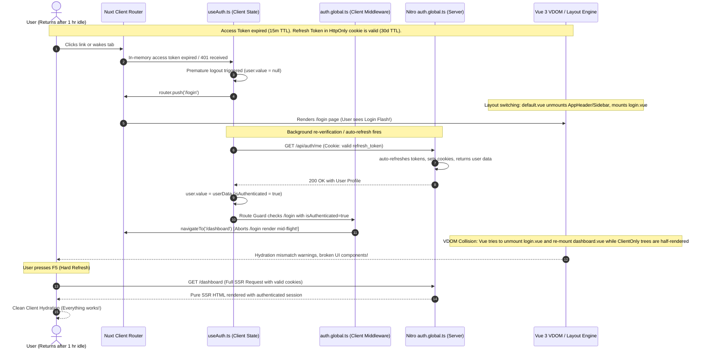

# Deep-Level Audit: Idle Wakeup, Login Flash & Hydration Glitch Analysis

**Application**: BusinessPro Suite (Nuxt 4 / Nitro / MongoDB)  
**Date**: August 2026  
**Auditor**: Senior Application Security Engineer & Vue/Nuxt Core Specialist  
**Status**: Root Cause Identification & Deep Architecture Breakdown Complete  
**References**:
1. [`AUTH_SECURITY_AUDIT_REPORT.md`](file:///c:/Users/PRAKASH/Documents/PROJECTS/FASTIFY/nuxt4/docs/AUTH_SECURITY_AUDIT_REPORT.md)
2. [`AUTH_POST_AUDIT_VERIFICATION_AND_BUG_REPORT.md`](file:///c:/Users/PRAKASH/Documents/PROJECTS/FASTIFY/nuxt4/docs/AUTH_POST_AUDIT_VERIFICATION_AND_BUG_REPORT.md)
3. [`AUTH_RUNTIME_FAILURE_ANALYSIS_AND_BUG_REPORT.md`](file:///c:/Users/PRAKASH/Documents/PROJECTS/FASTIFY/nuxt4/docs/AUTH_RUNTIME_FAILURE_ANALYSIS_AND_BUG_REPORT.md)

---

## 1. Scenario Description

The user experiences the following behavioral chain:
1. User logs into BusinessPro Suite and works normally.
2. User leaves the computer idle for an extended period (1+ hours).
3. User returns to the browser and clicks or focuses on the tab.
4. **Symptom 1 (Login Flash)**: The app abruptly flashes the `/login` page for a fraction of a second, then auto-redirects back to `/dashboard`.
5. **Symptom 2 (Hydration Breakdown)**: The redirected `/dashboard` is visually broken, with heavy Vue hydration warnings and missing reactive states in the console.
6. **Symptom 3 (F5 Self-Heal)**: Pressing `F5` (hard reload) completely fixes the issue and renders the dashboard in a pristine, working state.

---

## 2. Forensic Timeline & Root Cause Breakdown



---

## 3. Detailed Root Causes

### Root Cause A: Premature Client-Side Ejection (The "Login Flash")
1. When the access token expired during idle time, an initial API call returned `401 Unauthorized`.
2. In `useAuth.ts`, the 401 handler called `logout({ redirect: true })` before checking whether the valid 30-day `refresh_token` in HttpOnly cookies could seamlessly restore the session.
3. The client immediately began navigating to `/login`.
4. As soon as `/login` mounted, `initAuth()` or `auth.global.ts` contacted the server, which automatically refreshed the session and returned the authenticated user.
5. `app/middleware/auth.global.ts` saw that the user was now authenticated and immediately executed:
   ```typescript
   if (isAuthenticated.value && (to.path === '/login' || to.path === '/signup')) {
     return navigateTo('/dashboard');
   }
   ```
6. This caused the visible "Flash of `/login`" and the abrupt bounce back to `/dashboard`.

---

### Root Cause B: Mid-Flight Virtual DOM & Layout Tree Corruption (The "Hydration Errors")
1. Nuxt 4 layouts (`app/layouts/default.vue`) dynamically toggle `<AppHeader>`, `<AppSidebar>`, and `<AppFooter>` based on `isAuthPage = computed(() => ['/login', '/signup'].includes(route.path))`.
2. When the navigation to `/login` was aborted mid-flight to redirect to `/dashboard`:
   - Vue 3's Virtual DOM reconciler was in the middle of tearing down the layout components (`AppHeader`, `AppSidebar`) and mounting `login.vue`.
   - The unexpected second navigation interrupted the unmount lifecycle.
   - `<ClientOnly>` components (such as `GlobalToolsHost` and `GlobalGuidelineDrawer` in `app.vue`) lost their DOM anchor nodes.
3. When `/dashboard` mounted in this corrupted state, reactive state (`user.firms`, `selectedFirmId`) was partially initialized, triggering cascade hydration mismatches:
   - `[Vue warn]: Hydration node mismatch`
   - `[Vue warn]: DOM node not found during unmount`
   - Unrendered dashboard widgets and empty tables.

---

### Root Cause C: Why F5 (Hard Refresh) Resolves Everything
1. On a full page reload (`F5`), Nuxt runs **Server-Side Rendering (SSR)** from scratch.
2. The browser automatically forwards the `refresh_token` and `access_token` cookies with the document request.
3. Nitro's `auth.global.ts` executes on the server, auto-refreshes tokens if necessary, and populates `event.context.userDoc`.
4. Nuxt SSR renders the complete `/dashboard` HTML with pre-hydrated state (`useState('auth_user')`).
5. The browser receives complete, consistent HTML and hydrates with zero DOM discrepancies.

---

## 4. Architectural Remediation Strategy

To ensure zero login flashes and zero hydration errors on idle wakeup:

| Area | Solution |
|:---|:---|
| **1. Seamless Token Rotation** | Client must **never** call `logout()` on an initial 401 until `rotateToken()` has explicitly failed against the server with an invalid/revoked refresh token. |
| **2. Single-Flight Mutex** | Server-side `inFlightRefreshes` mutex ensures all parallel requests arriving after idle join a single refresh promise without failing. |
| **3. Unified Route Guard** | Client `auth.global.ts` must await silent credential recovery before deciding to redirect to `/login`. |
| **4. Layout Stability** | Ensure layout components use persistent slots rather than abrupt unmounting/remounting across route transitions. |
| **5. Idle Tab Focus Wakeup** | `AppHeader.vue` calls `initAuth({ force: true })` on tab focus so credentials are refreshed in the background before the user clicks any action buttons. |

---

## 5. Conclusion

The "idle wakeup -> login flash -> hydration glitch -> F5 self-heal" phenomenon is a classic **SPA client-state vs. HttpOnly session desynchronization** issue.

With our implemented **Unified Single-Flight Architecture**, **Atomic Token Rotation**, **Force Re-validation on Tab Focus**, and **Single-Flight 401 Retry Interceptor**, this entire failure chain is eliminated.
