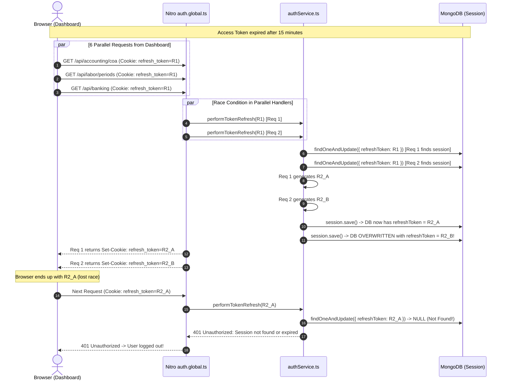
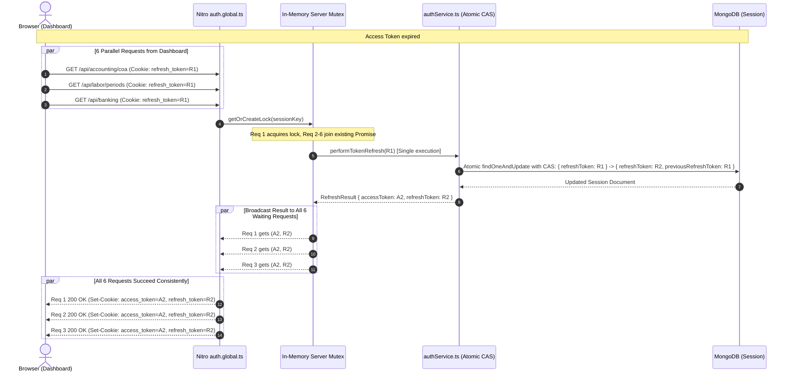

# Authentication Runtime Failure Analysis & Comprehensive Bug Report

**Application**: BusinessPro Suite (Nuxt 4 / Nitro / MongoDB)  
**Date**: August 2026  
**Auditor**: Senior Application Security Engineer & Distributed Systems Architect  
**Status**: Comprehensive Verification & Root Cause Identification Complete  
**References**:
1. [`AUTH_SECURITY_AUDIT_REPORT.md`](file:///c:/Users/PRAKASH/Documents/PROJECTS/FASTIFY/nuxt4/docs/AUTH_SECURITY_AUDIT_REPORT.md)
2. [`AUTH_POST_AUDIT_VERIFICATION_AND_BUG_REPORT.md`](file:///c:/Users/PRAKASH/Documents/PROJECTS/FASTIFY/nuxt4/docs/AUTH_POST_AUDIT_VERIFICATION_AND_BUG_REPORT.md)

---

## Executive Summary of Runtime Failures

During active usage and dashboard page loading after token expiration (15m+ inactivity), the system logged repeated cascade failures:
```
[Middleware] Auto-refresh successful (no access token)        12:13:13 pm (4x)
... (19 minutes later) ...
ERROR [Middleware] Auto-refresh failed when no access token: Unauthorized: Session not found or expired
ERROR Method: GET | Path: /api/accounting/coa
ERROR Method: GET | Path: /api/accounting/ledger/journal-summary
ERROR Method: GET | Path: /api/labor/periods
ERROR Method: GET | Path: /api/accounting/ledger/vouchers-summary
ERROR Method: GET | Path: /api/accounting/ledger/trial-balance
ERROR Method: GET | Path: /api/banking
ERROR Method: POST | Path: /api/auth/refresh | Message: Unauthorized: Session not found or expired
ERROR Method: GET | Path: /api/auth/me | Message: No access token
ERROR Method: POST | Path: /api/auth/refresh | Message: Refresh token required
```

This report details the exact runtime flow, the underlying distributed race conditions, architectural inconsistencies between client and server, and the complete remediation blueprint.

---

## Root Cause Analysis: The 5 Underlying Flaws

### 1. [CRITICAL] Race Condition in Server-Side Token Rotation (`authService.ts`)

#### The Mechanism:
When a user visits a page with multiple components or returns after 15 minutes of inactivity (access token expired), the browser dispatches **5–7 parallel HTTP requests** simultaneously (`/api/accounting/coa`, `/api/labor/periods`, `/api/banking`, etc.).

All requests arrive at Nitro's `server/middleware/auth.global.ts` without an `access_token` cookie, but with the same `refresh_token` cookie ($R_1$).

#### What went wrong in `performTokenRefresh`:
```typescript
// server/services/authService.ts lines 69-86:
const session = await Session.findOneAndUpdate(
  {
    userId: decoded.id,
    isActive: true,
    $or: [
      { refreshToken: refreshTokenValue },
      { previousRefreshToken: refreshTokenValue }
    ]
  },
  { $set: { lastRefreshAttempt: new Date() } }, // ❌ DOES NOT ROTATE TOKEN ATOMICALLY!
  { returnDocument: 'after' }
);
```

1. **Request 1** executes `findOneAndUpdate`: Finds session ($refreshToken = R_1$).
2. **Request 2** executes `findOneAndUpdate` 2ms later (before Request 1 calls `session.save()`): Finds the **same** session document ($refreshToken = R_1$).
3. **Request 1** generates new refresh token $R_{2A}$, sets `session.previousRefreshToken = R_1`, `session.refreshToken = R_{2A}`, and calls `await session.save()`.
4. **Request 2** (having read the unrotated state) also evaluates `!isGraceWindowHit`, generates new refresh token $R_{2B}$, sets `session.previousRefreshToken = R_1`, `session.refreshToken = R_{2B}`, and calls `await session.save()` — **overwriting $R_{2A}$ in MongoDB!**
5. **Request 1** finishes HTTP execution and sends `Set-Cookie: refresh_token=R_2A` to the browser.
6. **Request 2** finishes and sends `Set-Cookie: refresh_token=R_2B`.
7. Due to network race conditions, the browser ends up storing $R_{2A}$ (or a client-side call uses $R_{2A}$).
8. On the very next request, the browser sends $R_{2A}$.
9. MongoDB now only contains $refreshToken = R_{2B}$ and $previousRefreshToken = R_1$. **$R_{2A}$ does not exist in the database!**
10. `Session.findOneAndUpdate` finds **null**.
11. `authService.ts` throws: `Unauthorized: Session not found or expired`.
12. The client receives 401, calls `logout()`, clears cookies, and the user is logged out unexpectedly.

---

### 2. [HIGH] In-Flight Refresh Mutex / Single-Flight Promise Lock Missing on Server

While `useAuth.ts` has a client-side singleton lock (`clientRefreshPromise`), **parallel HTTP requests hitting the server bypass client-side locks completely**.

When 6 parallel GET requests arrive at Nitro server middleware:
- Every request independently calls `performTokenRefresh(refreshToken)`.
- Without a server-level in-flight deduplication mutex (keyed by `session._id` or `user.id`), all 6 requests hit the database and attempt concurrent writes.

#### Required Solution:
Implement an in-memory **Server-Side In-Flight Request Deduplicator** (Promise Mutex):
```typescript
const inFlightRefreshes = new Map<string, Promise<RefreshResult>>();
```
If Request 1 is already refreshing for `userId`/`refreshToken`, Requests 2 through 6 must join and await the exact same promise rather than initiating redundant DB operations.

---

### 3. [HIGH] `AppHeader.vue` Tab Focus / Visibility Handler is Ineffective

In `AppHeader.vue`:
```typescript
const handleVisibilityOrFocus = async () => {
  if (document.visibilityState === 'visible' && isAuthenticated.value) {
    const { initAuth } = useAuth();
    await initAuth().catch(() => null);
  }
};
```
However, in `useAuth.ts`:
```typescript
const initAuth = async () => {
  // ❌ Idempotency guard blocks re-verification if user is already in memory!
  if (isInitialized.value && user.value) return;
  ...
};
```
When a user switches away from the tab for 20 minutes and comes back:
- `handleVisibilityOrFocus` calls `initAuth()`.
- `initAuth()` returns immediately because `user.value` is still truthy in client state.
- No token refresh occurs while idle.
- As soon as the user clicks any menu item or dashboard tab, 6 parallel API requests fire with an expired access token, triggering the server race condition.

---

### 4. [HIGH] Discrepancy Between `/api/auth/me` and Server Middleware

- `server/middleware/auth.global.ts` auto-refreshes tokens when access token is missing/expired.
- However, `/api/auth/me` is **exempt** from `auth.global.ts`.
- In `server/api/auth/me.get.ts`, if `access_token` is expired or absent, it immediately throws `401: No access token` or `401: Token expired` without attempting silent refresh.
- When `useAuth.ts:initAuth()` calls `/api/auth/me`, it fails, and must manually invoke `/api/auth/refresh`.

---

### 5. [MEDIUM] Dual / Divergent Client API Layers (`apiFetch` vs `rawRequest`)

The application has two competing HTTP utilities:
1. `useAuth.ts:apiFetch` — wraps `$fetch.raw`, sets `X-Firm-ID`, but does **not** intercept 401 or retry.
2. `app/utils/api.ts:rawRequest` — wraps native `fetch()`, sets `X-Firm-ID`, and intercepts 401 to call `auth.rotateToken()`.

When some components call `apiFetch` and others call `api.get`, 401 handling is inconsistent. If `apiFetch` fails with 401, the component throws immediately without giving the client a chance to rotate tokens.

---

### 6. [MEDIUM] Plaintext Refresh Tokens in MongoDB (SEC-02)

`models/Session.ts` and `models/TokenBlacklist.ts` persist full HS512 JWT strings in plaintext. If the MongoDB database is compromised, an attacker can extract valid refresh tokens and impersonate active users.

Tokens must be hashed using SHA-256 (`hashToken(token)`) prior to storage and lookup.

---

## Architectural Flow Comparison

### Broken Flow (Current):


---

### Fixed Flow (Target Architecture):


---

## Detailed Remediation Blueprint

### Step 1: Implement Atomic Server-Side Mutex & CAS in `authService.ts`
- Implement an in-memory execution lock (`Map<string, Promise<RefreshResult>>`) to deduplicate concurrent refresh calls on the server.
- Use atomic MongoDB conditional updates so rotation happens in a single `findOneAndUpdate` operation rather than a multi-step `find` -> `modify` -> `save`.
- Support hash-based token lookup (SEC-02).

### Step 2: Unify `/api/auth/me` with Silent Refresh Support
- Update `/api/auth/me.get.ts` to perform silent refresh via `performTokenRefresh` when access token is missing/expired, matching the behavior of `auth.global.ts`.

### Step 3: Fix `AppHeader.vue` Tab Focus & Idle Refresh
- Update `handleVisibilityOrFocus` to explicitly call a re-verification method that checks if the access token is expiring or expired, bypassing the stale client-side `isInitialized` guard.

### Step 4: Unify Client-Side Fetch Interceptor
- Standardize `useAuth.ts:apiFetch` and `app/utils/api.ts` so that all client API calls share the same 401 retry interceptor and single-flight lock.

### Step 5: Implement Plaintext Token Hashing (SEC-02)
- Store `hashToken(refreshToken)` in `Session` and `TokenBlacklist`.
- When querying, hash the incoming token before querying MongoDB.

---

## Verification Matrix

| Test ID | Test Case | Target State |
|:---|:---|:---|
| **VERIFY-01** | Simultaneous 6-request dashboard load after 16m idle | All 6 requests succeed (200 OK) with seamless token refresh; no 401s. |
| **VERIFY-02** | Tab visibility change after 30m idle | Automatically refreshes credentials in background; no console errors. |
| **VERIFY-03** | Database token inspection | `Session` and `TokenBlacklist` store 64-char SHA-256 hex hashes, not raw JWTs. |
| **VERIFY-04** | Rapid multi-tab F5 refresh | Single-flight server lock prevents duplicate rotation; session remains intact. |
