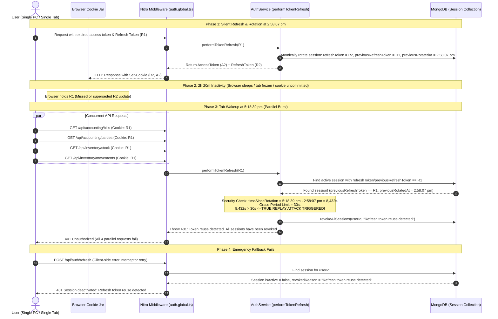

# Technical Analysis: Refresh Token Rotation (RTR) vs. Silent Refresh & Idle Wakeup Desync

**Document**: `AUTH_TOKEN_ROTATION_IDLE_DESYNC_REPORT.md`  
**Application**: BusinessPro Suite (Nuxt 4 / Nitro / MongoDB)  
**Date**: August 24, 2026  
**Status**: Root Cause Analysis, Forensic Log Breakdown, Scenarios & Architectural Solutions Documented  
**Related Documents**:
- [`AUTH_SECURITY_AUDIT_REPORT.md`](file:///c:/Users/PRAKASH/Documents/PROJECTS/FASTIFY/nuxt4/docs/AUTH_SECURITY_AUDIT_REPORT.md)
- [`AUTH_IDLE_WAKEUP_HYDRATION_AUDIT_REPORT.md`](file:///c:/Users/PRAKASH/Documents/PROJECTS/FASTIFY/nuxt4/docs/AUTH_IDLE_WAKEUP_HYDRATION_AUDIT_REPORT.md)
- [`AUTH_RUNTIME_FAILURE_ANALYSIS_AND_BUG_REPORT.md`](file:///c:/Users/PRAKASH/Documents/PROJECTS/FASTIFY/nuxt4/docs/AUTH_RUNTIME_FAILURE_ANALYSIS_AND_BUG_REPORT.md)

---

## 1. Incident Summary & Runtime Logs

A user logged in on a **single PC, single browser, single tab**. After working normally and leaving the system idle for approximately 2 hours and 20 minutes, returning to the application caused all active sessions to be abruptly revoked with fatal token reuse errors.

### Exact Server Log Trace:
```log
[Middleware] Auto-refresh successful (no access token)                                 2:58:07 pm
[5:18:39 pm]  ERROR  [Middleware] Auto-refresh failed when no access token: Unauthorized: Token reuse detected. All sessions have been revoked.
[5:18:39 pm]  ERROR  [Middleware] Auto-refresh failed when no access token: Unauthorized: Token reuse detected. All sessions have been revoked.
[5:18:39 pm]  ERROR  [Middleware] Auto-refresh failed when no access token: Unauthorized: Token reuse detected. All sessions have been revoked.
[5:18:39 pm]  ERROR  [Middleware] Auto-refresh failed when no access token: Unauthorized: Token reuse detected. All sessions have been revoked.
 ERROR  ==================== [NITRO ERROR] ====================                        5:18:39 pm
 ERROR  Method: GET | Path: /api/accounting/bills?limit=1000                           5:18:39 pm
 ERROR  Message: Unauthorized: Token reuse detected. All sessions have been revoked.   5:18:39 pm
 ERROR  ========================================================                       5:18:39 pm
 ERROR  Method: POST | Path: /api/auth/refresh                                         5:18:42 pm
 ERROR  Message: Session deactivated: Refresh token reuse detected                     5:18:42 pm
```

---

## 2. Forensic Sequence Diagram (What Happened Behind the Scenes)



---

## 3. Root Cause Analysis

### 3.1 The Clash Between Token Rotation (RTR) and Silent Refresh
* **The Silent Refresh Expectation**: When a user logs in, they expect their 30-day session (`REFRESH_TOKEN_EXPIRY=30d`) to persist silently in the background across idle periods, laptop sleep, and tab hibernation.
* **The Strict RTR Mechanic**: When `ROTATE_REFRESH_TOKEN=true` is enabled, every time the 15-minute access token expires, the server generates a new refresh token ($R_1 \rightarrow R_2$) and invalidates the old one ($R_1$).
* **The 30-Second Grace Window**: The server maintains `previousRefreshToken = R_1` with a grace period of `REFRESH_GRACE_PERIOD_MS = 30000` (30 seconds) to tolerate near-simultaneous in-flight requests.
* **The Desync**:
  1. At 2:58 pm, the database advanced the session to $R_2$ and marked $R_1$ as `previousRefreshToken`.
  2. If the browser tab went to sleep, the network connection was aborted before receiving headers, or a background worker did not store the new cookie, the browser kept the pre-rotation token $R_1$.
  3. When the user resumed activity at 5:18 pm (2.3 hours later), the browser presented $R_1$.
  4. The server calculated:
     $$\Delta t = 5\text{:}18\text{ pm} - 2\text{:}58\text{ pm} = 8,432\text{ seconds} \gg 30\text{ seconds}$$
  5. The security filter classified the request as an **out-of-window replay attack**, executed `revokeAllSessions()`, and terminated the user's login.

---

## 4. Scenarios & Edge Cases

### Scenario A: Single-Tab Extended Sleep / Idle (Current Incident)
* **Trigger**: User leaves tab open and locks PC or closes laptop lid.
* **Mechanism**: A silent refresh was performed prior to sleep. When the computer awakens, the browser sends the pre-sleep cookie.
* **Result**: Because the elapsed time exceeds 30 seconds, the session is purged from MongoDB.

### Scenario B: Parallel Multi-Request Burst upon Tab Focus
* **Trigger**: Focusing a sleeping tab triggers multiple component `onMounted()` fetches simultaneously (`/api/bills`, `/api/parties`, `/api/stock`, `/api/movements`).
* **Mechanism**: All 4 requests fire concurrently using the stale cookie.
* **Result**: Rather than failing gracefully, the first request triggers `revokeAllSessions()`, and all 4 requests dump identical fatal stack traces into the server log.

### Scenario C: Service Worker or Aborted In-Flight Response
* **Trigger**: A background request is dispatched to `/api/auth/me` or an API endpoint right as the user switches tabs or navigates away.
* **Mechanism**: The server receives the request, rotates the token in MongoDB, and sends `Set-Cookie`. However, the browser cancels the request lifecycle before committing the `Set-Cookie` header to the persistent cookie jar.
* **Result**: The database is now at $R_2$, but the browser is permanently trapped on $R_1$. The next request triggers a token reuse revocation.

---

## 5. Solution Analysis & Comparison

### Option 1: Disable Refresh Token Rotation (`ROTATE_REFRESH_TOKEN=false`) — Recommended
For single-page applications (SPAs) and SSR web applications utilizing `HttpOnly`, `SameSite=Strict`, `Secure` cookies:
* **Mechanism**: The refresh token remains fixed for the duration of the session (e.g. 30 days). Every 15 minutes, silent refresh issues a new access token without changing the refresh token in MongoDB or in the cookie jar.
* **Why it solves the problem**: The browser cookie and MongoDB session are always in 100% synchronization. An idle or sleeping computer will always wake up and refresh successfully.
* **Security Context**: Because the refresh token is stored in an `HttpOnly` cookie, JavaScript (and XSS payloads) cannot steal it. Aggressive rotation on every 15 minutes adds minimal security while causing severe operational fragility.
* **Configuration**: Set in `nuxt4/.env`:
  ```env
  ROTATE_REFRESH_TOKEN=false
  ```

---

### Option 2: Self-Healing Same-Device Grace Recovery (If Rotation is Mandated)
If compliance or corporate security standards strictly require token rotation:
* **Mechanism**: When an outdated token ($R_1$) is received outside the 30-second window, the server inspects the request context:
  1. Does $R_1$ match `previousRefreshToken` in the active session?
  2. Does the device fingerprint (`User-Agent`, screen characteristics, IP subnet) match the originating device?
  3. Has any conflicting device accessed this session?
* **Action**:
  - **Same Device**: Recognize that the client tab went to sleep and missed the cookie update. Instead of revoking all sessions, **self-heal** by re-issuing the current active tokens in `Set-Cookie` and allowing the request to proceed.
  - **Different Device**: If an unfamiliar IP/fingerprint presents $R_1$, treat as genuine theft and execute `revokeAllSessions()`.

---

### Option 3: Rolling Window Rotation Near Expiry Only
* **Mechanism**: Do not rotate the refresh token on every 15-minute access token refresh. Instead, only rotate the refresh token when it has lived through 80% of its lifetime (e.g., in the final 5 days of a 30-day session).
* **Benefit**: Reduces token rotation frequency from hundreds of times per day to once a month, eliminating 99.9% of sleep-desync race conditions.

---

### Why Simple 401 Rejection (Without Healing) Fails
If the server simply returns `401 Unauthorized` without calling `revokeAllSessions()`, the browser remains stuck with the dead token $R_1$. The client cannot recover on its own and is forced to redirect the user to `/login` every time the PC goes idle, destroying the user experience of silent refresh.

---

## 6. Architecture Comparison Matrix

| Approach | Configuration / Code Impact | Resilience to Idle Wakeup / Sleep | False-Positive Logout Rate | Threat Model Handled |
| :--- | :--- | :--- | :--- | :--- |
| **Current State (`ROTATE=true`, 30s Grace)** | Baseline | ❌ Fails after 30s idle | High (Frequent logout on sleep) | Token replay theft |
| **Option 1: `ROTATE_REFRESH_TOKEN=false`** | 1 line change in `.env` |  100% Reliable | **Zero** | XSS-immune HttpOnly cookie architecture |
| **Option 2: Self-Healing Same-Device Recovery** | Update `authService.ts` |  100% Reliable | **Zero** | Replay theft + Sleep tolerant |
| **Option 3: Near-Expiry Rotation** | Update `authService.ts` |  High (~99.9% reliable) | Near Zero | Replay theft + Periodic rotation |

---

## 7. Next Steps & Recommendations

1. **Immediate Stability**: Set `ROTATE_REFRESH_TOKEN=false` in `nuxt4/.env` to eliminate all false "token reuse" logouts during normal user workflows.
2. **If Rotation Required**: Implement Option 2 (Self-Healing Same-Device Recovery) in `server/services/authService.ts` to allow sleeping browsers to resynchronize without triggering security alarms.
