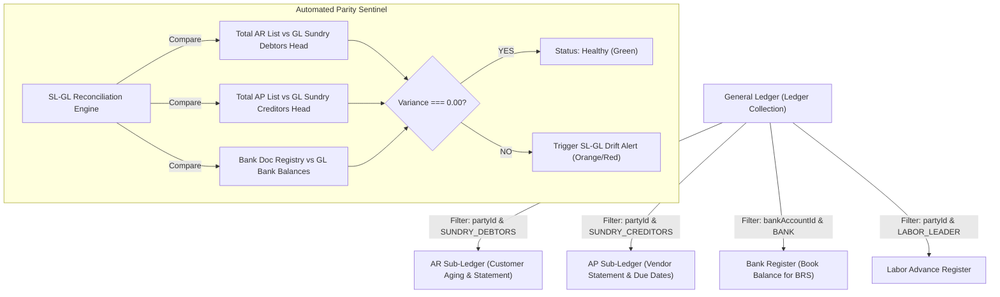
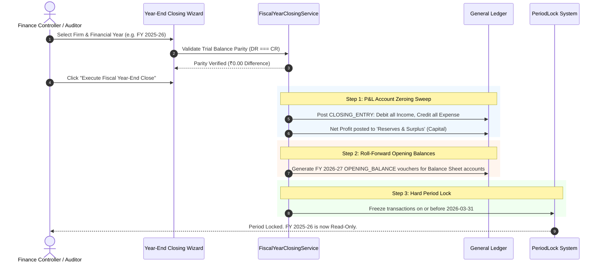

# Enterprise ERP Unification Blueprint: Accounts & Banking Architecture

**Document Version:** 1.0.0  
**Target Platform:** Nuxt 4 + MongoDB + PostgreSQL Hybrid ERP  
**Scope:** Core Financial Engine, Sub-Ledgers, Treasury Banking, Fiscal Compliance  

---

## Executive Summary

To transition this ERP from a collection of modular web features into a **Tier-1 Enterprise ERP** (comparable to SAP S/4HANA, NetSuite, and Tally Prime), three architectural pillars must be unified:

1. **Consolidated Unified Posting Engine (`UnifiedPostingService`)**: Eliminating 5 divergent transaction pipelines and unifying all journal, billing, payroll, and banking postings under a single atomic, double-entry certified engine.
2. **Sub-Ledger to General Ledger (SL-GL) Real-Time Reconciliation**: Ensuring Accounts Receivable (AR), Accounts Payable (AP), Treasury Banks, and Labor Advances are strict mathematical projections of the General Ledger, with zero drift.
3. **Financial Period Lock & Year-End Closing Wizard**: Enforcing statutory freeze dates on closed/audited periods and providing an automated fiscal year-end sweep of P&L into Retained Earnings.

---

# Pillar 1: Consolidated Single Unified Posting Engine

### 1.1 The Problem & Current Architectural Fragmentation
Currently, General Ledger vouchers are constructed and inserted across **5 independent codebases**, each using different conventions:

```
[Sales / Purchases]       --> LedgerService.postSalesLedger / postPurchaseLedger
[Direct Daybook UI]       --> SmartVoucherConverter --> Ledger.insertMany
[Bulk Vendor Payments]    --> custom inline loop in bulk-payments/index.post.ts
[Labor Wages & Advances]  --> laborLedgerHelper.ts (has its own private COA resolver)
[Opening Balances]        --> OpeningBalanceService.syncOpeningBalance
```

#### Vulnerabilities of Current Fragmentation:
- **Divergent Voucher Group Identifiers**: `smart-voucher-converter` uses numeric sequence integers, `laborLedgerHelper` uses UUID strings, `bills` uses `BILL-{id}`, and opening balances use `OB-{FY}-{Head}`. Auditing cross-module vouchers requires disparate lookup logic.
- **Duplicated Account Resolvers**: `labor-ledger-helper.ts` implements a duplicate `resolveLedgerPostingAccount` with separate logic from `ledger-account-resolver.ts`.
- **Inconsistent Atomic Sessions**: Some endpoints wrap insertions in MongoDB transactions; others do raw un-sessioned inserts, risking half-posted vouchers if network or server crashes occur mid-loop.

---

### 1.2 Target Unified Architecture

All modules must delegate to a single entry point: `UnifiedPostingService.postVoucher(payload, session)`.

```mermaid
flowchart TD
    subgraph Upstream Modules
        M1["Billing (Sales / Purchases / Returns)"]
        M2["Banking Hub & Payouts"]
        M3["Labor Payroll & Advances"]
        M4["Manual Daybook / Journal Entries"]
        M5["Year-End & Adjusting Entries"]
    end

    Upstream Modules --> UPS["UnifiedPostingService.postVoucher()"]

    subgraph Core Posting Engine
        UPS --> V1["1. Period Lock Guard (Reject if Date is Frozen)"]
        V1 --> V2["2. Dual Account Resolver (COA & Sub-Ledger Validation)"]
        V2 --> V3["3. Double-Entry Parity Check (Debit === Credit down to 0.001)"]
        V3 --> V4["4. Sequential Voucher Number Generation (Gapless Sequence)"]
        V4 --> V5["5. Atomic Storage Execution (Session Transaction)"]
    end

    V5 --> GL["General Ledger (Ledger Collection)"]
    V5 --> EV["Event Bus / Audit Trail Log"]
```

#### Standard Transaction Schema:
Every voucher must follow the strict `IVoucherPayload` contract:
```typescript
interface IVoucherLeg {
  accountHead: string;
  accountType?: string;
  debitAmount: number;
  creditAmount: number;
  partyId?: mongoose.Types.ObjectId | string;
  bankAccountId?: mongoose.Types.ObjectId | string;
  stockId?: mongoose.Types.ObjectId | string;
  narration?: string;
}

interface IVoucherPayload {
  firmId: mongoose.Types.ObjectId | string;
  voucherType: 'SALES' | 'PURCHASE' | 'PAYMENT' | 'RECEIPT' | 'CONTRA' | 'JOURNAL' | 'OPENING_BALANCE' | 'CLOSING_ENTRY';
  transactionDate: string; // YYYY-MM-DD
  referenceNo?: string;    // Bill No / Cheque No / UTR
  narration: string;
  legs: IVoucherLeg[];
  createdBy: string;
  tags?: Record<string, any>; // { laborPeriodId, bulkPaymentId, billId }
}
```

---

### 1.3 Concrete Real-World Scenarios

#### Scenario A: Labor Settlement with Advance Deduction & Bank Payout
- **Business Action**: Settle Labor Leader "Moti Kumar" for work period. Total Wages: ₹80,000. Prior Advance Recovered: ₹30,000. Cash Payout: ₹10,000. Bank Transfer from BOI: ₹40,000.
- **Unified Engine Payload**:
  - Leg 1: `Wages & Labor Expense` | DR ₹80,000 | (Expense)
  - Leg 2: `Advance to Labor (Moti Kumar)` | CR ₹30,000 | (Asset clearance)
  - Leg 3: `Cash in Hand` | CR ₹10,000 | (Asset reduction)
  - Leg 4: `Bank of India - CC` | CR ₹40,000 | (Bank payout)
- **Engine Enforcement**:
  - $\sum \text{Debits} = 80,000 \equiv \sum \text{Credits} = (30,000 + 10,000 + 40,000) = 80,000$.
  - Single atomic voucher group created: `VOUCHER/2026-27/PV/0412`.

#### Scenario B: B2B Sale with Multi-Item Stock, TCS, and GST
- **Business Action**: Invoice to Customer "ABC Corp". Taxable: ₹1,00,000. CGST: ₹9,000. SGST: ₹9,000. Round-off: ₹0.40. Net Invoice: ₹1,18,000.40. COGS of items sold: ₹65,000.
- **Unified Engine Payload**:
  - Leg 1: `ABC Corp (Sundry Debtors)` | DR ₹1,18,000.40
  - Leg 2: `Sales Account` | CR ₹1,00,000.00
  - Leg 3: `CGST Output Payable` | CR ₹9,000.00
  - Leg 4: `SGST Output Payable` | CR ₹9,000.00
  - Leg 5: `Round Off` | CR ₹0.40
  - Leg 6: `Cost of Goods Sold (COGS)` | DR ₹65,000.00
  - Leg 7: `Inventory Asset` | CR ₹65,000.00
- **Engine Enforcement**: Total DR (₹1,83,000.40) $\equiv$ Total CR (₹1,83,000.40). Zero manual calculations.

---

### 1.4 After-Fix Pros & Cons

#### Pros:
1. **Zero Math Failures**: Invariant $\sum \text{DR} = \sum \text{CR}$ checked in 1 centralized function with automatic throw on $> 0.01$ paisa mismatch.
2. **Deterministic Sequence Numbers**: All vouchers across all modules receive formal sequential numbers (e.g. `PV/2026-27/0001`, `JV/2026-27/0045`) eliminating unnumbered records.
3. **Audit Trail Immutability**: All modifications or cancellations create linked reversal vouchers rather than hard-deleting database records.

#### Cons / Trade-offs:
1. **Refactoring Overhead**: Requires migrating existing callers in 5 legacy files to the new `UnifiedPostingService` contract.
2. **Strictness Constraints**: Legacy endpoints that passed incomplete metadata will now be rejected if account heads cannot be resolved.

---

### 1.5 File List for Pillar 1

| Path | Role in Architecture |
| :--- | :--- |
| `server/utils/accounting/unified-posting.service.ts` | **NEW CORE**: Central Posting Engine with double-entry assertion and sequence generation |
| `server/utils/labor-ledger-helper.ts` | Refactor: Delegate labor settlement/advance postings to `UnifiedPostingService` |
| `server/api/accounting/vouchers.post.ts` | Refactor: Switch from `SmartVoucherConverter` raw insert to `UnifiedPostingService` |
| `server/api/accounting/bulk-payments/index.post.ts` | Refactor: Use unified engine for multi-leg beneficiary payment vouchers |
| `server/api/accounting/bills/[id]/cancel.post.ts` | Refactor: Generate reversing entries via unified posting pipeline |
| `server/utils/accounting/ledger.service.ts` | Align legacy methods (`postSalesLedger`, `postPurchaseLedger`) to wrap `UnifiedPostingService` |

---

# Pillar 2: Sub-Ledger to General Ledger (SL-GL) Reconciliation

### 2.1 The Problem & Root Cause of Drift
In basic accounting software, sub-ledgers (like Customer lists, Supplier profiles, or Bank card details) store isolated balance fields (`party.openingBalance`, `bankAccount.balance`).
If a voucher is posted in the General Ledger without referencing the exact `partyId` or `bankAccountId`, or if a user modifies an invoice outside the sub-ledger:
- **Accounts Receivable Sub-ledger**: Shows Customer owes ₹45,000.
- **General Ledger**: `Sundry Debtors` shows ₹50,000.
- **The Audit Failure**: Statutory auditors cannot reconcile the Schedule III Balance Sheet with the physical party ledger.

```
       Current Drift Hazard:
       ┌────────────────────────┐         ┌────────────────────────┐
       │     Party Document     │         │     General Ledger     │
       │   openingBalance: 25k  │  ≠≠≠≠   │   Sundry Debtors: 30k  │
       │   currentBalance: 40k  │         │   (Unlinked Journals)  │
       └────────────────────────┘         └────────────────────────┘
```

---

### 2.2 Target Architecture: Pure GL Projection with Parity Sentinel

In a true Enterprise ERP, **the General Ledger is the ONLY source of truth**. Sub-ledgers are **views (projections)** derived directly from GL entries tagged with `partyId` or `bankAccountId`.



---

### 2.3 Concrete Real-World Scenarios

#### Scenario A: Direct Bank Payment to Vendor without Party Tagging
- **Occurrence**: An accountant posts a Daybook Payment Voucher: `Dr Telephone Expense ₹5,000, Cr Bank ₹5,000`. But in another entry, they pay `Vendor ABC ₹20,000` typing the name into `narration` rather than selecting the `partyId`.
- **Resulting Drift**:
  - GL Sundry Creditors decreases by ₹20,000.
  - Sub-ledger for "Vendor ABC" still shows unpaid ₹20,000 because `partyId` was null!
- **Unified Engine Fix**:
  - The Posting Engine enforces: Any line posting to `SUNDRY_DEBTORS`, `SUNDRY_CREDITORS`, or `LABOR_LEADER` **MUST** include a valid `partyId`. If missing, the transaction is rejected at the API boundary.

#### Scenario B: Bank Charges Automatically Deducted by Bank
- **Occurrence**: ₹354 GST & annual bank charges deducted by Bank of India.
- **Drift**: Bank passbook balance is ₹354 lower than the ERP bank card balance.
- **Unified Engine Fix**:
  - BRS module automatically matches the ₹354 statement line and posts a `PAYMENT` voucher: `Dr Bank Charges (OPEX) ₹300, Dr CGST Input ₹27, Dr SGST Input ₹27, Cr Bank Account ₹354`.
  - Both GL Bank Account and Bank Master Card reduce by ₹354 simultaneously.

---

### 2.4 After-Fix Pros & Cons

#### Pros:
1. **100% Audit Confidence**: $\sum \text{Customer Statement Balances} \equiv \text{Balance Sheet Sundry Debtors}$ down to ₹0.00.
2. **Instant Ageing Accuracy**: Eliminates phantom overdue invoices that were paid via manual journal entries.
3. **Automated Diagnostic**: An automated diagnostic endpoint `/api/accounting/audit/sl-gl-reconciliation` instantly highlights any untagged vouchers.

#### Cons / Trade-offs:
1. **Strict Input Requirement**: Users can no longer enter arbitrary free-text party names in journals without choosing a registered master entity.

---

### 2.5 File List for Pillar 2

| Path | Role in Architecture |
| :--- | :--- |
| `server/utils/accounting/sl-gl-reconciler.service.ts` | **NEW**: Real-time comparator checking Sub-Ledgers against GL Control Accounts |
| `server/api/accounting/audit/sl-gl-reconcile.get.ts` | **NEW API**: Surfaces variances across Debtors, Creditors, Banks, and Labor |
| `server/api/accounting/parties.get.ts` | Refactor: Ensure customer/supplier balances are computed strictly from GL aggregations |
| `server/utils/accounting/ledger-account-resolver.ts` | Update: Ensure every party head is linked with bidirectional `partyId` indexing |
| `app/pages/accounting/statements.vue` | UI Update: Display Sub-Ledger parity verification badge on Balance Sheet |

---

# Pillar 3: Financial Period Lock & Year-End Closing Wizard

### 3.1 The Problem: The Danger of Unrestricted Historical Editing
In enterprise accounting, **financial history is legally immutable once filed**:
- GST returns (GSTR-1, GSTR-3B) are filed on the 11th and 20th of every month.
- Annual Financial Statements (P&L and Balance Sheet) are audited by Chartered Accountants on March 31st.

#### The Critical Risk in Current Codebase:
Any user with billing or journal access can create, edit, or delete an invoice dated `2025-05-15`.
- Doing so **silently alters the revenue, GST liability, and inventory valuation** of a previously filed return!
- If tax authorities conduct an audit, the database figures will contradict the filed tax returns, resulting in severe non-compliance penalties.

---

### 3.2 Target Architecture: Two-Tier Period Lock & Fiscal Year Closing



---

### 3.3 Concrete Real-World Scenarios

#### Scenario A: Preventing Unauthorized Edit of a Filed Quarter
- **Event**: Accountant attempts to edit Purchase Bill #PB-88 dated `2025-11-12`.
- **System Defense**:
  - `enforcePeriodLock(firmId, '2025-11-12')` checks the firm's `lockDate`.
  - Firm lock date is set to `2025-12-31` (Q3 closed).
  - System immediately throws: `403 Forbidden: Transaction date 2025-11-12 falls within locked fiscal period (Locked up to 2025-12-31). Request admin unlock override.`
  - Database write is prevented before execution.

#### Scenario B: Automated March 31st Financial Year Close
- **State on March 31, 2026**:
  - Total Revenue: ₹1,50,00,000 (Cr)
  - Total Expenses + COGS: ₹1,20,00,000 (Dr)
  - Net Profit: ₹30,00,000
- **Closing Wizard Execution**:
  1. Creates Year-End Closing Voucher dated `2026-03-31`:
     - `Dr Sales Account` ₹1,50,00,000 (Account zeroed out)
     - `Cr Purchases & Direct Expenses` ₹80,00,000 (Account zeroed out)
     - `Cr Salaries & Indirect Expenses` ₹40,00,000 (Account zeroed out)
     - `Cr Reserves & Surplus (Equity)` ₹30,00,000 (Profit transferred to Equity)
  2. Temporary accounts (P&L) start April 1, 2026 with **₹0.00**.
  3. Permanent accounts (Bank, Cash, Debtors, Creditors, Fixed Assets, Reserves) automatically become the **Opening Balances of FY 2026-27**.
  4. Books are locked up to `2026-03-31`.

---

### 3.4 After-Fix Pros & Cons

#### Pros:
1. **Statutory Audit Compliance**: Complete protection against retrospective data corruption.
2. **Clean Financial Year Transitions**: Eliminates the manual nightmare of manually typing opening balances for 200+ accounts every April 1st.
3. **Auditor Confidence**: Clean distinction between operating vouchers and year-end closing adjustment entries.

#### Cons / Trade-offs:
1. **Workflow Restriction**: Users can no longer arbitrarily fix past typos without requesting an administrator to temporarily move or unlock the freeze date.

---

### 3.5 File List for Pillar 3

| Path | Role in Architecture |
| :--- | :--- |
| `server/models/PeriodLock.ts` | **NEW MODEL**: Stores locked dates, reason, locked_by, and firm isolation |
| `server/utils/accounting/period-lock.service.ts` | **NEW SERVICE**: Interceptor checking `transactionDate > lockDate` on all write operations |
| `server/utils/accounting/fiscal-year-closing.service.ts` | **NEW SERVICE**: Executes P&L sweep to Reserves and rolls forward opening balances |
| `server/api/accounting/period-lock/index.get.ts` & `.post.ts` | **NEW API**: Admin endpoint to set or view fiscal freeze dates |
| `server/api/accounting/year-end-close/execute.post.ts` | **NEW API**: Executes the Year-End Closing Wizard |
| `app/components/accounting/YearEndClosingModal.vue` | **NEW UI**: Interactive wizard displaying P&L summary, audit check, and confirmation |

---

# Summary of Technical Deliverables

```
docs/enterprise-erp-unification-blueprint.md
├── Pillar 1: Single Unified Posting Engine (PostingService, atomic sessions, gapless sequence)
├── Pillar 2: Sub-Ledger to General Ledger (SL-GL Real-Time Sentinel, 100% projection)
└── Pillar 3: Financial Period Lock & Year-End Closing (Immutable freeze, P&L sweep wizard)
```

This document serves as the binding architectural masterplan to transition this application into an **Enterprise-Grade ERP System**.
