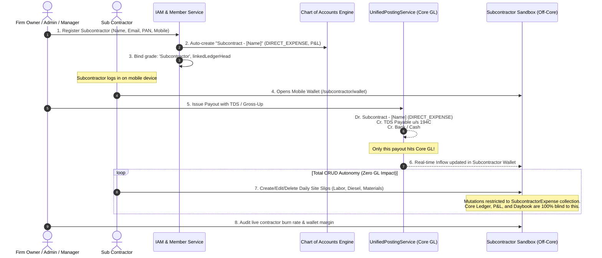

# Subcontractor Direct Expense, TDS Engine & Off-Core Sandboxed Wallet Architecture

**Document Version:** 1.0.0  
**Target Platform:** Nuxt 4 + MongoDB + PostgreSQL Hybrid ERP  
**Module:** Subcontractor Management, Statutory TDS (Sec 194C / 195A / 206AA), Mobile-First Site Wallet, Off-Core Job Expense Tracking  
**Audience:** System Architects, Full-Stack Engineers, Chartered Accountants, Works Contract Project Managers  

---

## 1. Executive Summary & Foundational Difference

In works contracts and infrastructure projects, businesses engage two fundamentally distinct types of field actors:

```
┌────────────────────────────────────────────────────────────────────────────────────────┐
│                              THE ARCHITECTURAL DICHOTOMY                               │
├────────────────────────────────────────────────────────┬───────────────────────────────┤
│ 👷 SITE SUPERVISOR (Internal Field Agent)              │ 🏗️ SUB CONTRACTOR (Third-Party)│
├────────────────────────────────────────────────────────┼───────────────────────────────┤
│ • Employee / Internal Agent of the Firm                │ • Independent External Entity / Vendor       │
│ • Receives Advance Float (Asset: Loans & Advances)     │ • Receives Work Payouts (Direct Expense)     │
│ • Incurs expenses on behalf of our firm                │ • Incurs expenses on his OWN account         │
│ • Approved claims post to Company Core GL              │ • Daily slips NEVER touch Core GL            │
│ • No TDS applied (internal staff float)                │ • Mandatory TDS u/s 194C / 195A Gross-Up     │
│ • Maker–Checker approval required to post expense      │ • Full CRUD autonomy inside his sandbox      │
│ • Goal: Clear company advance balance                  │ • Goal: Track contractor cash burn & margin  │
└────────────────────────────────────────────────────────┴───────────────────────────────┘
```

### The Core Problem This Solves:
1. **P&L Pollution & Tax Audit Disallowance:** When subcontractors purchase sand, fuel, or hire coolies at site, accountants often mistakenly book these chits into the company's general ledger. This distorts company P&L, violates Section 40A(3) / GST rules (invoices are not in company's name), and risks "Principal Employer" legal liabilities.
2. **Subcontractor Advance Traps:** Paying unstructured advances without statutory TDS deduction invites penalties u/s 40(a)(ia) (30% disallowance of expenditure) and leads to unrecovered contractor bad debts.
3. **Contractor Lack of Visibility:** Subcontractors frequently dispute deductions, claims, and net payouts because they keep manual pocket diaries that don't match the head office's books.

### The Solution:
* The firm pays the subcontractor against a dedicated **Direct Expense** head in Chart of Accounts with automated **TDS u/s 194C (Standard Deduction or Sec 195A Gross-Up)**. This is the **ONLY** transaction that touches the Core General Ledger.
* The subcontractor receives a dedicated **Mobile-First Sandboxed Wallet**.
* The subcontractor has **Complete CRUD Autonomy** to record, modify, and delete his own site slips (labor, diesel, cement, tools) with **ZERO impact on our company's books**.
* Firm Owners, Admins, and Managers have real-time read-only monitoring into the contractor's live site burn and margins.

---

## 2. End-to-End System Process Flow



---

## 3. Statutory TDS Engine: Rules, Rates & Formulas

TDS calculations strictly comply with the Indian Income Tax Act, 1961, leveraging the existing `TdsCalculator` (`server/utils/accounting/tds-calculator.ts`):

### 3.1 Entity Classification via 4th Character of PAN:
* **`P` (Individual) or `H` (HUF):** Standard TDS rate is **1%** u/s 194C.
* **`C` (Company), `F` (Partnership/LLP), `A` (AOP), `T` (Trust):** Standard TDS rate is **2%** u/s 194C.
* **Invalid or Missing PAN:** Higher rate of **20%** u/s 206AA.

### 3.2 Statutory Thresholds (Section 194C(5)):
* **Single Transaction Threshold:** No deduction if single payment/bill $\le ₹30,000$.
* **Aggregate Financial Year Threshold:** No deduction if cumulative payments in the FY $\le ₹1,00,000$.
* **Progressive Breach ("Grow-Up" / Catch-Up):** Once aggregate FY payments cross ₹1,00,000, TDS is retroactively applicable to the prior exempt payments made in that financial year.

### 3.3 Computation Formulas:

#### A. Standard Deduction Mode (Contractor Borne Tax):
$$\text{Gross Booked} = \text{Invoice/Contract Amount}$$
$$\text{TDS Amount} = \text{Gross Booked} \times r + \text{Catch-up TDS (if applicable)}$$
$$\text{Net Payout to Subcontractor} = \text{Gross Booked} - \text{TDS Amount}$$

#### B. Gross-Up Mode ("Grow-Up" / Company Borne Tax u/s 195A):
When the commercial contract dictates that the subcontractor must receive an exact net amount in hand (e.g. ₹50,000 cash/bank transfer free of deductions):
$$\text{Gross Amount to Book in Expense} = \frac{\text{Net Payout}}{1 - r}$$
$$\text{TDS Borne by Company} = \text{Gross Amount} - \text{Net Payout}$$

---

## 4. Real-World Business Scenarios & Numerical Examples

### Scenario 1: Standard Individual Subcontractor (Single Payment > ₹30,000)
* **Contractor:** *Suresh Earthmoving (Individual, PAN: `ABCPS1234F`)*
* **Entity Type:** Individual (4th character `P`) $\rightarrow$ TDS Rate: **1%**
* **Work Executed:** Site grading and excavation work bill: ₹65,000
* **Payment Mode:** Bank Transfer (HDFC Bank)
* **Calculation:**
  * Gross Expense: ₹65,000
  * Single payment $> ₹30,000 \implies$ Section 194C applies.
  * $\text{TDS} = ₹65,000 \times 1\% = ₹650$
  * $\text{Net Payout} = ₹65,000 - ₹650 = ₹64,350$
* **Core Accounting Journal Voucher Posted:**
  $$\text{Dr. Subcontract - Suresh Earthmoving (DIRECT\_EXPENSE)} \quad ₹65,000.00$$
  $$\text{Cr. TDS Payable u/s 194C (CURRENT\_LIABILITY)} \quad ₹650.00$$
  $$\text{Cr. HDFC Bank Account (BANK)} \quad ₹64,350.00$$
* **Subcontractor Wallet Impact:**
  * Inflow received: **+₹64,350** (with audit note: "Gross: ₹65,000, TDS 1%: ₹650").
  * Core GL Impact: 1 clean balanced voucher.

---

### Scenario 2: Corporate Subcontractor (Company PAN @ 2%)
* **Contractor:** *Apex Infra Projects Pvt Ltd (PAN: `AABCA9876C`)*
* **Entity Type:** Company (4th character `C`) $\rightarrow$ TDS Rate: **2%**
* **Work Executed:** Structural piling work: ₹2,50,000
* **Calculation:**
  * $\text{TDS} = ₹2,50,000 \times 2\% = ₹5,000$
  * $\text{Net Payout} = ₹2,50,000 - ₹5,000 = ₹2,45,000$
* **Core Accounting Journal Voucher Posted:**
  $$\text{Dr. Subcontract - Apex Infra Projects (DIRECT\_EXPENSE)} \quad ₹2,50,000.00$$
  $$\text{Cr. TDS Payable u/s 194C (CURRENT\_LIABILITY)} \quad ₹5,000.00$$
  $$\text{Cr. ICICI Bank Account (BANK)} \quad ₹2,45,000.00$$

---

### Scenario 3: Higher Rate for Missing / Invalid PAN (Sec 206AA @ 20%)
* **Contractor:** *Local Tractor Haulage (No PAN provided)*
* **TDS Rate:** Higher statutory penalty rate of **20%**
* **Payment Amount:** ₹40,000
* **Calculation:**
  * $\text{TDS} = ₹40,000 \times 20\% = ₹8,000$
  * $\text{Net Payout} = ₹40,000 - ₹8,000 = ₹32,000$
* **Core Accounting Journal Voucher Posted:**
  $$\text{Dr. Subcontract - Local Tractor Haulage (DIRECT\_EXPENSE)} \quad ₹40,000.00$$
  $$\text{Cr. TDS Payable u/s 194C / 206AA (CURRENT\_LIABILITY)} \quad ₹8,000.00$$
  $$\text{Cr. Cash in Hand (CASH)} \quad ₹32,000.00$$
* **Tax Defense:** The firm is 100% compliant with Section 206AA; zero risk of 30% expenditure disallowance during assessment.

---

### Scenario 4: "Grow-Up" / Gross-Up Mode u/s 195A (Fixed Net in Pocket)
* **Contractor:** *Master Carpenter Salim (Individual, PAN: `BLZPS5544K`)*
* **Agreement:** The firm agrees to pay Salim exactly ₹50,000 in bank transfer; company absorbs the tax.
* **TDS Rate:** 1% ($r = 0.01$)
* **Calculation:**
  $$\text{Gross Amount} = \frac{50,000}{1 - 0.01} = \frac{50,000}{0.99} = ₹50,505.05$$
  $$\text{TDS Borne by Firm} = ₹50,505.05 - ₹50,000.00 = ₹505.05$$
* **Core Accounting Journal Voucher Posted:**
  $$\text{Dr. Subcontract - Salim Carpenter (DIRECT\_EXPENSE)} \quad ₹50,505.05$$
  $$\text{Cr. TDS Payable u/s 194C (CURRENT\_LIABILITY)} \quad ₹505.05$$
  $$\text{Cr. State Bank of India Account (BANK)} \quad ₹50,000.00$$
* **Outcome:**
  * Salim receives exactly ₹50,000 in his bank account.
  * Salim's wallet shows ₹50,000 inflow.
  * Government receives ₹505.05 TDS credited against Salim's PAN in Form 26AS.
  * Firm legitimately books ₹50,505.05 as allowable direct works expense.

---

### Scenario 5: Progressive FY Threshold Breach ("Grow Up" Catch-Up u/s 194C(5))
* **Contractor:** *Ganesh Shuttering Works (Individual PAN, 1%)*
* **Month 1 (April):** Bill 1 = ₹20,000 (No TDS because $< ₹30,000$). Paid Net: ₹20,000. YTD: ₹20,000.
* **Month 2 (May):** Bill 2 = ₹25,000 (No TDS because $< ₹30,000$). Paid Net: ₹25,000. YTD: ₹45,000.
* **Month 3 (June):** Bill 3 = ₹28,000 (No TDS because $< ₹30,000$). Paid Net: ₹28,000. YTD: ₹73,000.
* **Month 4 (July):** Bill 4 = ₹35,000.
  * **Threshold Analysis:**
    * $\text{Prior YTD} = ₹73,000$ (No TDS was deducted on any prior bills).
    * $\text{New YTD} = ₹73,000 + ₹35,000 = ₹1,08,000$.
    * **Breach:** The ₹1,00,000 annual aggregate threshold has been breached!
  * **Catch-Up Calculation:**
    * Regular TDS on Bill 4 ($₹35,000 \times 1\%$): ₹350.00
    * Catch-up TDS on prior exempt payments ($₹73,000 \times 1\%$): ₹730.00
    * **Total TDS Deducted on this Voucher:** $₹350 + ₹730 = ₹1,080.00$
    * **Net Payout to Ganesh:** $₹35,000 - ₹1,080 = ₹33,920.00$
* **Core Accounting Journal Voucher Posted:**
  $$\text{Dr. Subcontract - Ganesh Shuttering (DIRECT\_EXPENSE)} \quad ₹35,000.00$$
  $$\text{Cr. TDS Payable u/s 194C (CURRENT\_LIABILITY)} \quad ₹1,080.00$$
  $$\text{Cr. Bank Account (BANK)} \quad ₹33,920.00$$
* **Tax Audit Compliance:** The company captures the full 1% on the entire ₹1,08,000 YTD turnover, eliminating statutory interest penalties u/s 201(1A).

---

### Scenario 6: Subcontractor Site Expense CRUD (Zero Impact on Core Books)
* **Contractor:** *Suresh Earthmoving* received net ₹64,350 from the company.
* **Day 1:** Suresh buys 150 liters diesel for his excavator from site petrol bunk = ₹13,500.
  * Action: Suresh taps **"+ Add Expense"** in his mobile wallet.
  * Inputs: Category = `FUEL_DIESEL`, Payee = *HPCL Bunk*, Amount = ₹13,500, Mode = `UPI`.
  * Result: Stored in `SubcontractorExpense`. **Zero entries created in `Ledger` or P&L.**
* **Day 2:** Suresh pays daily wages to 8 coolies = ₹6,400.
  * Action: Logs Category = `LABOR`, Amount = ₹6,400, Mode = `CASH`.
* **Day 3:** Suresh realizes he typed ₹6,400 instead of ₹5,600.
  * Action: He opens his expense list, clicks **Edit**, changes amount to ₹5,600, and saves.
  * Result: Record updated instantly in `SubcontractorExpense`. No reversal vouchers needed because core books were never touched!
* **Day 4:** Accidental duplicate slip of ₹1,200 for tea/snacks.
  * Action: He clicks **Delete** on the slip.
  * Result: Document deleted from his collection.
* **Wallet Balance Summary on Suresh's Phone:**
  $$\text{Funds Received from Head Office:} \quad +₹64,350.00$$
  $$\text{Less Site Expenses (Diesel ₹13,500 + Labor ₹5,600):} \quad -₹19,100.00$$
  $$\mathbf{Current\ In-Hand\ Balance:\ } \quad \mathbf{₹45,250.00}$$
* **Core Accounting Status:** Company P&L still shows only the ₹65,000 direct expense booked on Day 1. Suresh's micro-expenses remain in his off-core sandbox.

---

### Scenario 7: Subcontractor Spends More Than Received (Negative Float Tracking)
* **Context:** Subcontractor *Rohan Roadworks* received ₹1,00,000 from the company.
* **Site Emergency:** Sudden boulder rock blasting requires emergency specialized machinery and detonator charges totaling ₹1,35,000.
* **Rohan's Action:** Rohan pays ₹35,000 out of his personal savings / trade credit. He logs the full ₹1,35,000 expense in his wallet.
* **Subcontractor Wallet Result:**
  * Total Inflow: ₹1,00,000
  * Total Expenses: ₹1,35,000
  * **Live Balance:** **-₹35,000 (Deficit / Out of Pocket)**
  * Mobile UI Badge: 🔴 `Deficit: ₹35,000 (Claimable from Company)`
* **Core Accounting Status:** Zero ledger entries. Company books are not distorted by the contractor's emergency credit.
* **Resolution:** Firm Admin views Rohan's monitoring tab, verifies the machine logs, and processes a fresh payout of ₹50,000 with TDS, bringing Rohan's balance back to $+₹15,000$.

---

### Scenario 8: Firm Management Auditing Contractor Burn & Profitability
* **Actor:** Project Director / Firm Owner opens `/subcontractor/monitoring`.
* **Dashboard View:**
  | Subcontractor | Total Paid by Firm (Gross) | TDS Deducted | Net Paid (Inflow) | Actual Site Burn | Contractor Float Balance | Status |
  | :--- | :---: | :---: | :---: | :---: | :---: | :---: |
  | **Suresh Earthmoving** | ₹65,000 | ₹650 | ₹64,350 | ₹19,100 | **+₹45,250** | 🟢 Healthy |
  | **Rohan Roadworks** | ₹1,00,000 | ₹1,000 | ₹99,000 | ₹1,35,000 | **-₹36,000** | 🔴 In Deficit |
  | **Apex Infra Pvt Ltd** | ₹2,50,000 | ₹5,000 | ₹2,45,000 | ₹2,10,000 | **+₹35,000** | 🟢 Healthy |
* **Insight:** Management knows exactly how much real work is happening on site without calling the contractor or sifting through physical chits.

---

## 5. Mobile-First Subcontractor Wallet UI Architecture

Construction sites are high-friction environments (glare, dust, slow 4G/3G connectivity, single-thumb usage on mobile devices). The subcontractor portal is engineered **strictly Mobile-First**:

```
┌────────────────────────────────────────────────────────┐
│  ☰  VIKRAM EARTHMOVERS          [PRJ-BLR-METRO]  🔔    │
├────────────────────────────────────────────────────────┤
│  WALLET BALANCE (CASH IN HAND)                         │
│  ₹ 45,250.00                                           │
│  ┌────────────────────────┬──────────────────────────┐ │
│  │ ⬇ Received: ₹64,350    │ ⬆ Spent: ₹19,100         │ │
│  └────────────────────────┴──────────────────────────┘ │
│  Tax Credit u/s 194C: ₹650 (Deposited to PAN)          │
├────────────────────────────────────────────────────────┤
│  ⚡ QUICK ACTIONS                                      │
│  [ + Log Expense ]   [ 📋 View Slips ]   [ 📄 Statement]│
├────────────────────────────────────────────────────────┤
│  RECENT TRANSACTIONS                                   │
│                                                        │
│  🔴 HPCL Diesel Bunk                   - ₹ 13,500.00   │
│     Fuel & Diesel • Yesterday • UPI    [Edit] [Delete] │
│                                                        │
│  🔴 Site Coolie Gang (8 workers)       - ₹  5,600.00   │
│     Labour • 02 Oct 2026 • Cash        [Edit] [Delete] │
│                                                        │
│  🟢 Payout from Head Office (JV-0492)  + ₹ 64,350.00   │
│     TDS Deducted: ₹650 @ 1% • 01 Oct                   │
├────────────────────────────────────────────────────────┤
│  [ 🏠 Wallet ]       [ ➕ Add Slip ]       [ 📊 History ]│
└────────────────────────────────────────────────────────┘
```

### Mobile UX Specifications:
1. **Touch Targets $\ge 48\text{px}$:** Large thumb-friendly buttons for "+ Log Expense", "Save Slip", and category pickers.
2. **Simplified Plain-Language Categories:**
   * 👷 Daily Labor
   * ⛽ Diesel & Fuel
   * 🧱 Local Materials (Sand/Bricks/Cement)
   * 🚜 Equipment & Machinery Hire
   * 🚚 Freight & Auto/Tempo
   * ☕ Refreshment & Food
   * 🔧 Minor Repairs & Spares
   * 📦 Other
3. **Inline CRUD with Instant Optimistic UI:** Adding, editing, or deleting a slip updates the wallet float immediately on the client side with background sync.
4. **Offline Resilience:** Slips saved during network dropouts queue locally and sync when signal returns.

---

## 6. Strict Architectural Safeguards & Zero-Regression Matrix

To guarantee that the existing **Supervisor Imprest**, **Labor Ledger**, and **Core General Ledger** are not affected:

```
┌────────────────────────────────────────────────────────────────────────────────────────┐
│                            DATA INTEGRITY & ISOLATION MATRIX                           │
├───────────────────────┬──────────────────────────┬─────────────────────────────────────┤
│ Component             │ Site Supervisor          │ Subcontractor (New)                 │
├───────────────────────┼──────────────────────────┼─────────────────────────────────────┤
│ User Grade            │ `'Supervisor'`           │ `'Subcontractor'`                   │
│ COA Account Head      │ `Advance - [Name] (Site)`│ `Subcontract - [Name]`              │
│ COA Account Type      │ `LOANS_ADVANCES` (Asset) │ `DIRECT_EXPENSE` (P&L)              │
│ Payout Voucher        │ PAYMENT (Asset Debit)    │ PAYMENT (Expense Debit + TDS Credit)│
│ Site Slip Storage     │ `SiteExpenseClaim`       │ `SubcontractorExpense`              │
│ Maker-Checker Needed? │ YES (Checker posts to GL)│ NO (Self-managed Sandbox)           │
│ Touches Core Ledger?  │ YES (Upon Approval)      │ NEVER (100% Isolated)               │
│ Sec 40A(3) Check?     │ Enforced at approval     │ Informational warning only          │
└───────────────────────┴──────────────────────────┴─────────────────────────────────────┘
```

---

## 7. Phased Implementation Plan

### Phase 1: IAM & Schema Extension (Zero Regression)
* Extend `UserGrade` in `server/models/User.ts` to include `'Subcontractor'`.
* Add `panNumber` to `IUserFirm`.
* Create `server/models/SubcontractorExpense.ts` with complete indexes on `(firmId, subcontractorUserId, expenseDate)`.
* Register new model in `server/models/register.ts`.

### Phase 2: Member Onboarding Hook (Direct Expense Auto-Provisioning)
* Update `server/api/firms/[firmId]/members.post.ts`:
  * Detect `grade === 'Subcontractor'`.
  * Auto-provision `Subcontract - [Name]` under `account_type: 'DIRECT_EXPENSE'` and `bs_classification: 'PNL'`.
  * Disambiguate duplicate names automatically.
  * Store in `linkedLedgerHead`.

### Phase 3: Payout Engine with TDS (194C / 195A Gross-Up)
* Extend payout API / modal to support paying Subcontractors against their `linkedLedgerHead`.
* Apply `TdsCalculator` with PAN validation, standard deduction, gross-up, and FY threshold checks.
* Post balanced voucher to Core GL via `UnifiedPostingService.postVoucher()`.

### Phase 4: Subcontractor Mobile Wallet APIs & Portal
* `GET /api/subcontractor/wallet`: Computes live float ($\sum \text{Net Payouts} - \sum \text{Expenses}$), TDS summary, and recent activity.
* `GET /api/subcontractor/expenses`: List, search, and filter site slips.
* `POST /api/subcontractor/expenses`: Create new site slip (Zero GL touch).
* `PUT /api/subcontractor/expenses/:id`: Edit slip (Zero GL touch).
* `DELETE /api/subcontractor/expenses/:id`: Delete slip (Zero GL touch).
* UI Pages:
  * `app/pages/subcontractor/wallet.vue` (Mobile-First Dashboard)
  * `app/pages/subcontractor/expense.vue` (Mobile-First Entry / Edit Form)
  * `app/pages/subcontractor/expenses.vue` (Mobile-First Expense History with Filters)
  * `app/middleware/auth.global.ts` update to route Subcontractors to `/subcontractor/wallet`.

### Phase 5: Management Oversight & Monitoring Dashboard
* `GET /api/accounting/subcontractor-wallets`: Aggregated list of all subcontractors with total payouts, TDS withheld, total expenses incurred, and float balance.
* UI Page: `app/pages/accounting/subcontractor-monitoring.vue` for Owners, Admins, and Managers.
