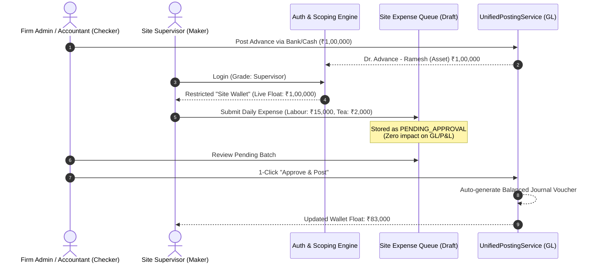

# Supervisor Imprest & Field Expense Architecture (Maker–Checker)

**Document Version:** 1.0.0  
**Target Platform:** Nuxt 4 + MongoDB + PostgreSQL Hybrid ERP  
**Module:** Accounting, Identity & Access Management (IAM), Works Contract Job Costing  
**Scope:** Site Supervisor Sub-Auth, Field Imprest Advances, Maker–Checker Approval Pipeline, General Ledger Auto-Posting  

---

## 1. Executive Summary & Problem Definition

In works contract and construction businesses, the head office frequently disburses lump-sum cash/bank advances to **Site Supervisors, Site Engineers, and Field Foremen**. These field agents incur daily decentralized site expenses on behalf of the firm:
* Unregistered local daily labor and coolie charges
* Local emergency materials (sand, cement, hardware, bricks)
* Labor welfare, tea, tiffin, and potable water
* Freight, auto, tempo, and loading/unloading charges
* Machine diesel, generator fuel, and minor site repairs

### Current Operational Bottlenecks:
1. **Uncertain Timelines & Data Lag:** Supervisors accumulate paper chits for weeks. The head office has zero visibility into actual daily site burn rates until month-end.
2. **Administrative Strain on Accounting:** Accountants spend days deciphering messy chits, manually calculating totals, and typing multi-leg journals.
3. **Audit & Compliance Vulnerabilities:** Uncontrolled cash expenditures can easily breach **Income Tax Section 40A(3)** (payments $> ₹10,000$ in cash per person per day are disallowed).

---

## 2. Target Solution: The Maker–Checker Site Wallet

To eliminate this bottleneck without compromising financial integrity, the system implements a **Sub-Authenticated Field Expense Workflow** adhering strictly to the **Maker–Checker** enterprise pattern:



*Note: Per business requirements, image/photo upload is **not required**, keeping data payloads fast, lightweight, and bandwidth-friendly on remote construction sites.*

---

## 3. Supervisor Onboarding & Sub-Auth Architecture

### 3.1 Admin-Driven Registration Workflow

In works contract operations, site supervisors and site engineers must **never be allowed to self-register** from a public signup page. Since supervisors are entrusted with company float and authorized to record field financial commitments, access must be provisioned exclusively by authorized company administrators.

```mermaid
flowchart TD
    A[Firm Admin / Owner] -->|1. Opens Team & Members| B[Onboarding Form: 'Add Site Supervisor']
    B -->|2. Inputs Details| C[Full Name, Mobile/Email, Temporary Password, Assigned Projects]
    C -->|3. Submits via API| D[POST /api/firms/:firmId/members]
    D -->|4. Validates Grade: 'Supervisor'| E[Create/Update User Document]
    E -->|5. Automated COA Provisioning Hook| F[Auto-Create 'Advance - [Name] (Site)' in COA]
    F -->|6. Atomically Link Account| G[UserFirm.linkedLedgerHead = Account Name]
    G -->|7. Ready for Use| H[Supervisor Logs in via Mobile / Admin Disburses Advance]
```

#### Onboarding Parameters & Validation:
1. **Administrative Boundary:** Only users holding `grade === 'Owner'` or `grade === 'Admin'` in the firm (or Superadmin) can execute the registration.
2. **Input Fields:**
   * **Full Name:** e.g., *"Ramesh Kumar"*
   * **Phone / Email:** Primary identifier for OTP / Login
   * **Temporary Password:** Secure system-generated string or admin-set password
   * **Grade:** Set to `'Supervisor'`
   * **Assigned Project(s) / Site(s):** Scopes the supervisor to specific project cost centers (e.g., `['PRJ-BLR-METRO-04', 'PRJ-NH-75-FLY']`).
   * **COA Provisioning Option:** Defaults to `AUTO_CREATE` (with an optional dropdown to link an existing legacy head if migrating from Tally).

---

### 3.2 Automated Chart of Accounts (COA) Provisioning Lifecycle

A primary operational question is: **Does the accountant need to manually create an account in Chart of Accounts, or does the system handle this automatically?**

#### The System-Automated Approach (Standard & Recommended):
To guarantee zero double-entry friction and prevent human naming mismatches (e.g. Accountant typing *"Ramesh Advance"* while User profile says *"Ramesh Kumar"*), the system **automatically provisions the COA ledger head during member registration**.

#### 1. Automated Provisioning Algorithm:
When `POST /api/firms/:firmId/members` executes with `grade: 'Supervisor'`:
```typescript
// 1. Generate standardized, collision-free Account Name
const sanitizedName = name.trim().replace(/\s+/g, ' ');
let targetAccountHead = `Advance - ${sanitizedName} (Site)`;

// 2. Check if head already exists in ChartOfAccounts
let existingAccount = await ChartOfAccounts.findOne({
  $or: [{ firm_id: firmIdObj }, { firmId: firmIdObj }],
  account_name: targetAccountHead
});

// 3. If collision exists (e.g., two supervisors named "Ramesh Kumar"), disambiguate with phone/id
if (existingAccount && !isLinkingExisting) {
  targetAccountHead = `Advance - ${sanitizedName} [${phone.slice(-4)}] (Site)`;
}

// 4. Auto-create COA Document if not already existing
if (!existingAccount) {
  existingAccount = await ChartOfAccounts.create({
    firm_id: firmIdObj,
    firmId: firmIdObj,
    account_name: targetAccountHead,
    account_type: 'ASSET', // Balance sheet asset: Loans & Advances
    bs_classification: 'BALANCE_SHEET',
    description: `Automated Imprest Float Account for Site Supervisor: ${sanitizedName}`,
    is_system: false,
    is_active: true,
    created_by: currentUserId
  });
}

// 5. Store canonical head in User's firm membership
targetFirmAssignment.linkedLedgerHead = targetAccountHead;
```

#### 2. Optional Manual Link (Legacy & Tally Migrations):
If the firm has already imported their historical Chart of Accounts from Tally or an older ERP containing pre-existing balances (e.g., `Ramesh Site Imprest A/c`), the registration modal provides a toggle:
* `(o) Auto-create standard Imprest Ledger (Recommended)`
* `( ) Link to existing Chart of Accounts Head` (Dropdown filtered by `account_type === 'ASSET'`).

#### 3. De-Provisioning & Exit Audit Guard:
When a supervisor resigns, completes their site contract, or leaves the company:
* The Admin attempts to suspend or deactivate the user.
* **Integrity Guard:** The system queries the General Ledger for the live balance of `user.linkedLedgerHead`.
  * **If Balance $\neq 0$ (e.g. Dr. ₹4,500 held in cash):** Deactivation is **BLOCKED**:
    > 🛑 **Cannot Deactivate Supervisor:**  
    > *Supervisor Ramesh Kumar holds ₹4,500 in un-settled company advance float. Please recover the cash balance or approve pending expense claims before closing this profile.*
  * **If Balance $\equiv 0$:** Deactivation succeeds. The supervisor's login access is revoked, and the COA head is marked `is_active: false` (hiding it from future payment dropdowns while permanently preserving past financial audits).

---

### 3.3 Grade & Role Expansion in `User` Model

Currently, `server/models/User.ts` enforces four membership grades:
```typescript
grade: 'Owner' | 'Admin' | 'Manager' | 'Staff';
```

We extend this model to introduce `'Supervisor'`:
```typescript
export type UserGrade = 'Owner' | 'Admin' | 'Manager' | 'Staff' | 'Supervisor';
```

Each user assigned the `Supervisor` grade is linked directly to their dedicated **Imprest Ledger Account Head** in the Chart of Accounts:

```typescript
export interface IUserFirm {
  firm: mongoose.Types.ObjectId;
  grade: 'Owner' | 'Admin' | 'Manager' | 'Staff' | 'Supervisor';
  linkedLedgerHead?: string; // e.g. "Advance to Ramesh Kumar (Site)"
  assignedProjectIds?: string[]; // Scoped projects/sites
}
```

---

### 3.4 Authorization & Scoping Matrix

| Module / Action | Owner / Admin | Manager | Staff | Supervisor (Sub-Auth) |
| :--- | :---: | :---: | :---: | :---: |
| **P&L / Balance Sheet / Trial Balance** | Full | View Only | Blocked | **Blocked (403)** |
| **Banking Balances & Treasury** | Full | Partial | Blocked | **Blocked (403)** |
| **Commercial Bills (Sales / Purchases)**| Full | Full | View Only | **Blocked (403)** |
| **Post Imprest Advance to Staff** | Full | Full | Blocked | **Blocked (403)** |
| **View Own Imprest Wallet & Balance** | Full | Full | Own Only | **Own Only (Restricted)** |
| **Record Field Expense (Maker)** | Full | Full | Full | **Yes (Draft Queue Only)** |
| **Approve & Commit to GL (Checker)** | Full | Full | Blocked | **Blocked (403)** |

---

## 4. System-Wide Impact Analysis

Introducing sub-authenticated field users and automated posting has zero regressions when isolated properly:

### 4.1 Impact on Core General Ledger (`Ledger`)
* **Zero Direct Mutation by Field Users:** Supervisors **never** execute `Ledger.insertMany()`, `Ledger.updateOne()`, or `Ledger.deleteMany()`.
* **Zero Unbalanced Entries:** Expenses submitted by supervisors sit in an isolated staging collection (`SiteExpenseClaim`).
* **Preserved GL Integrity:** The General Ledger is updated **only** when an authorized Accountant/Checker clicks "Approve", which delegates to `UnifiedPostingService.postVoucher()`. This guarantees:
  * Period Lock verification
  * Gapless sequential numbering (`JV/2026-27/XXXX`)
  * Mathematical double-entry parity ($\sum \text{DR} \equiv \sum \text{CR}$)

### 4.2 Impact on Client-Side Navigation & Routing
* **Nuxt Middleware Guard (`app/middleware/auth.ts`):**
  When a user logs in with `grade === 'Supervisor'`, the router intercepts and redirects them directly to `/field/wallet`.
  Access to `/accounting/*`, `/banking/*`, `/superadmin`, or master settings triggers an instant redirect with a permission notice.
* **Navigation Drawer / Sidebar:**
  All standard ERP navigation links (Invoices, Daybook, GST, Statements) are hidden. The supervisor sees a stripped-down, mobile-optimized interface:
  1. **Site Wallet** (Balance, Advance History)
  2. **Log Expense** (Quick Entry Form)
  3. **Submitted Claims** (Pending / Approved status)

### 4.3 Impact on Tax & Statutory Compliance
* **Sec 40A(3) Cash Limit Guard:** The entry form automatically evaluates if any single cash payment exceeds ₹10,000. It rejects or flags the transaction before submission, preventing disallowed business deductions.
* **Period Lock Compatibility:** If a supervisor submits a late expense dated in a closed financial month, the Checker's approval engine enforces the period lock and requests the entry date be adjusted to the current open period.

---

## 5. Staging Schema: `SiteExpenseClaim`

To decouple the supervisor's entry from the live GL, a dedicated staging collection is used:

```typescript
// server/models/SiteExpenseClaim.ts
import mongoose, { Schema, Document } from 'mongoose';

export interface ISiteExpenseClaim extends Document {
  firmId: mongoose.Types.ObjectId;
  supervisorId: mongoose.Types.ObjectId; // User._id
  supervisorName: string;
  imprestAccountHead: string; // "Advance to Ramesh - Site"
  
  expenseDate: string; // YYYY-MM-DD
  category: 'LABOUR' | 'MATERIAL' | 'WELFARE' | 'TRANSPORT' | 'FUEL' | 'REPAIRS' | 'OTHER';
  targetAccountHead: string; // e.g. "Site Labour Charges", "Staff Welfare"
  
  amount: number;
  paymentMode: 'CASH' | 'UPI' | 'NEFT';
  partyOrPayeeName?: string;
  narration: string;
  
  projectId?: string; // Optional Job Costing Site Tag
  status: 'PENDING' | 'APPROVED' | 'REJECTED';
  
  // Checker audit fields
  reviewedBy?: string;
  reviewedAt?: Date;
  rejectionReason?: string;
  generatedVoucherGroupId?: string; // Links to GL upon approval
}
```

---

## 6. Real-World Business Scenarios & Numerical Examples

### Scenario A: Standard Cycle (Advance $\rightarrow$ Expense $\rightarrow$ Replenishment)

* **Step 1 (Advance Disbursed):**
  Accountant sends ₹50,000 via NEFT to Supervisor Ramesh.
  * Voucher: `PAYMENT`
  * Entry:
    $$\text{Dr. Advance to Ramesh - Site (Current Asset)} \quad ₹50,000$$
    $$\text{Cr. HDFC Bank Account} \quad ₹50,000$$
  * *Ramesh's Wallet shows:* **₹50,000 In Hand**

* **Step 2 (Ramesh incurs 3 field expenses over 3 days):**
  * Day 1: 5 Daily coolies for site unloading = ₹3,500 (`LABOUR`)
  * Day 2: Site team lunch & tea = ₹850 (`WELFARE`)
  * Day 3: Urgent binding wire & nails from local shop = ₹4,200 (`MATERIAL`)
  * *Total Submitted:* ₹8,550
  * *Status:* `PENDING_APPROVAL` (GL is not yet touched).

* **Step 3 (Checker Approves):**
  Accountant opens the Approval Queue, reviews the 3 entries, and clicks **"Approve & Post Batch"**.
  The system calls `UnifiedPostingService.postVoucher()`:
  * Voucher Type: `JOURNAL` (`JV/2026-27/0142`)
  * Legs:
    $$\text{Dr. Site Labour Charges} \quad ₹3,500$$
    $$\text{Dr. Staff Welfare & Site Refreshments} \quad ₹850$$
    $$\text{Dr. Site Consumables & Hardware} \quad ₹4,200$$
    $$\text{Cr. Advance to Ramesh - Site} \quad ₹8,550$$
  * *Outcome:*
    * P&L immediately reflects the ₹8,550 expenses under respective cost heads.
    * Ramesh's live wallet float automatically updates: **₹41,450 remaining**.

---

### Scenario B: Supervisor Overspends (Out-of-Pocket Reimbursement)

Construction emergencies often require a supervisor to spend personal money when site float runs dry.

* **Initial Float:** ₹5,000
* **Emergency:** Generator breakdown; urgent repair parts cost ₹12,000.
* **Supervisor Action:** Ramesh pays ₹5,000 from company float and ₹7,000 from his personal UPI. He logs the full expense of ₹12,000.
* **Checker Action:** Accountant approves ₹12,000.
* **Accounting Entries Posted:**
  $$\text{Dr. Machinery Repairs & Maintenance} \quad ₹12,000$$
  $$\text{Cr. Advance to Ramesh - Site} \quad ₹12,000$$
* **Wallet Balance Result:**
  * Initial Balance: ₹5,000 (Dr.)
  * Credit Posted: ₹12,000 (Cr.)
  * **New Ledger Balance: ₹7,000 (Cr.)**
  * The system displays: **"Company Owes Supervisor: ₹7,000"** (Payable).
* **Resolution:**
  Accountant posts a Payment Voucher of ₹27,000:
  * ₹7,000 clears the debt owed to Ramesh.
  * ₹20,000 restores his fresh working float for the next week.

---

### Scenario C: Checker Rejection (Mistake / Personal Item)

* **Incident:** Supervisor mistakenly logs an expense of ₹1,800 for personal vehicle fuel not related to the works contract site.
* **Checker Action:** Accountant reviews the queue, clicks **"Reject"**, and types reason: *"Personal vehicle fuel; not authorized under Site Project B"*.
* **Outcome:**
  * Claim status changes to `REJECTED`.
  * Zero journal entries are generated.
  * Ramesh's advance balance is **not** credited (the ₹1,800 remains his liability to the company).
  * Ramesh receives the explanation in his submitted history.

---

### Scenario D: Statutory Cash Compliance Protection (Income Tax Sec 40A(3))

* **Rule:** Cash payment $> ₹10,000$ to a single party/vendor in a day is disallowed as an expense under Indian Income Tax Act.
* **Supervisor Action:** Ramesh tries to log:
  * Category: `MATERIAL`
  * Payee: *Krishna Bricks*
  * Amount: ₹16,000
  * Mode: `CASH`
* **Automated Guard Action:**
  The entry form validates before saving:
  > 🛑 **Statutory Violation Prevented (Sec 40A(3)):**  
  > *Cash payment to a single vendor cannot exceed ₹10,000 in one day. Please split by bank/UPI or have Head Office issue a direct vendor payout.*
* **Outcome:** The company is protected against disallowance during tax audits.

---

## 7. Category-to-COA Automatic Mapping

Supervisors should never be exposed to accounting jargon (Debit, Credit, Ledger Codes). They select everyday construction terms, which the system maps automatically:

| Friendly Category | Default Chart of Accounts Head | Default Account Type |
| :--- | :--- | :--- |
| 👷 **Daily Labour** | `Site Labour & Coolie Charges` | `DIRECT_EXPENSE` |
| ☕ **Tea & Tiffin** | `Staff & Labour Welfare` | `INDIRECT_EXPENSE` |
| 🧱 **Local Material** | `Site Consumables & Local Purchases` | `DIRECT_EXPENSE` |
| 🚚 **Transport / Tempo** | `Freight & Cartage Inward` | `DIRECT_EXPENSE` |
| ⛽ **Fuel & Diesel** | `Generator & Machine Fuel` | `DIRECT_EXPENSE` |
| 🔧 **Site Repairs** | `Machinery & Tools Maintenance` | `INDIRECT_EXPENSE` |

*Note: The Accountant/Checker can override the target COA head on the review screen prior to clicking "Approve".*

---

## 8. Phased Implementation Roadmap

1. **Phase 1: IAM & Schema Extension**
   * Add `'Supervisor'` to `UserGrade` enum in `User.ts`.
   * Add `linkedLedgerHead` and `assignedProjectIds` to `IUserFirm`.
   * Create `SiteExpenseClaim` MongoDB model and indexes.
2. **Phase 2: Supervisor Interface (`/field/wallet`)**
   * Lightweight mobile-friendly view.
   * Real-time float display: $\text{Current Balance} = \sum \text{Advances} - \sum \text{Approved Expenses}$.
   * Quick-entry form with Sec 40A(3) cash guard.
3. **Phase 3: Checker Approval Dashboard (`/accounting/imprest-approvals`)**
   * Grouped view by Supervisor and Project.
   * Multi-select batch approval or line-item rejection with feedback.
   * Seamless integration with `UnifiedPostingService.postVoucher()`.
4. **Phase 4: Audit & Export Reporting**
   * Supervisor-wise Imprest Reconciliation Statement (Excel / PDF).
   * Project Job Costing breakdown by field expense categories.
